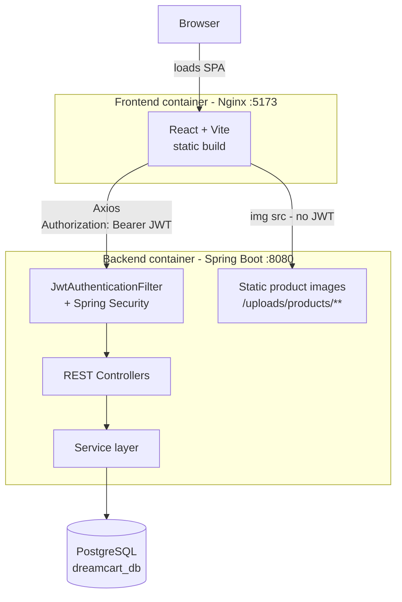
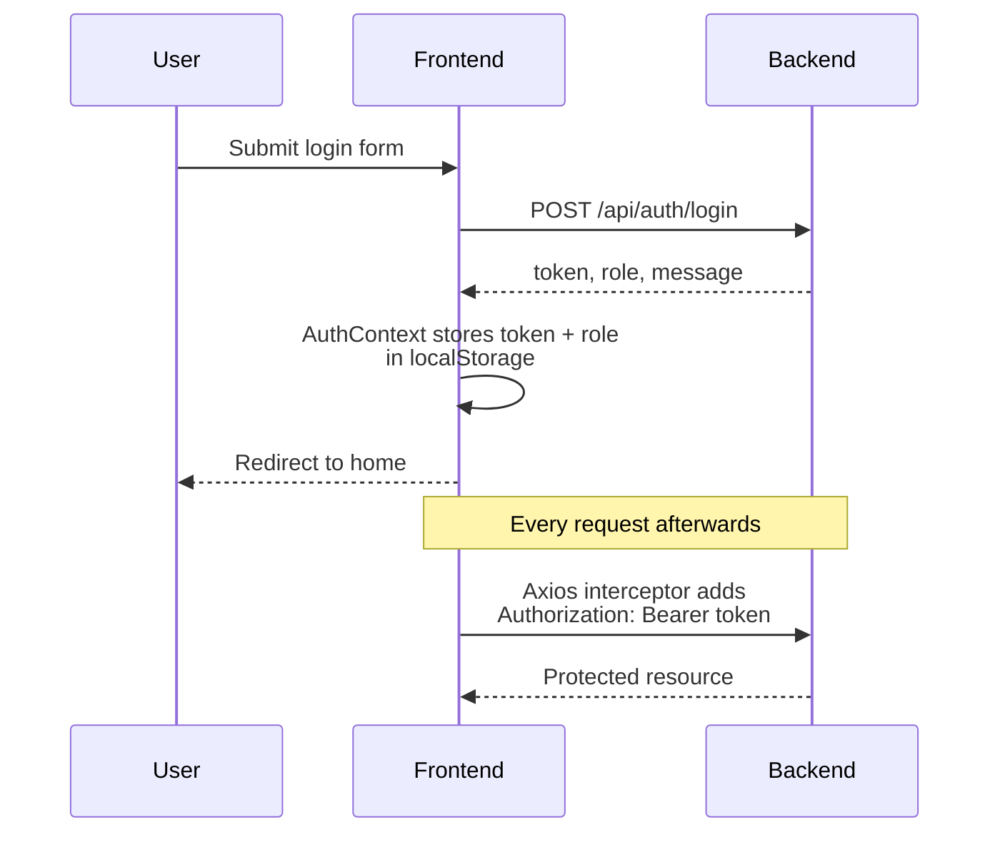

# DreamCart — Frontend

The customer- and admin-facing web app for **DreamCart**, a full-stack e-commerce platform. Built with React and Vite.

Backend repo: [dreamcart-backend](https://github.com/sushilranavare/dreamcart-backend)

## Tech Stack

- React 19
- Vite
- React Router v7
- Axios (with JWT auto-attached via a request interceptor)
- Context API for auth state
- Vitest + React Testing Library (unit/component tests)
- Docker (Nginx-served production build)

## Features

- User registration and login (JWT-based)
- Product browsing and search, with category filtering
- Product detail pages with reviews (write, edit, delete your own review; average rating shown)
- Cart and wishlist
- Checkout with saved/new shipping addresses and a simulated payment step
- Order history
- User profile (view/update details, change password)
- Admin dashboard: store statistics plus management of products, categories, users, and orders
- Role-based route protection (private routes for authenticated users, admin-only routes for admins)

## Architecture



## Login Flow



Route access is guarded client-side by `PrivateRoute` (authenticated users) and `AdminRoute` (admins only), on top of the backend's own role checks.

See the [backend README](https://github.com/sushilranavare/dreamcart-backend#key-flows) for the full checkout and payment flow diagram.

## Prerequisites

- Node.js 20+
- The backend API running (see [dreamcart-backend](https://github.com/sushilranavare/dreamcart-backend)) — this app expects it at `http://localhost:8080`

## Running Locally

```bash
npm install
npm run dev
```

The app runs at `http://localhost:5173`.

## Running with Docker

This app is built to run as part of the full stack via the backend repo's `docker-compose.yml`:

```bash
# from the dreamcart-backend directory
docker compose up --build
```

This serves the production build through Nginx at `http://localhost:5173`. The compose file assumes `dreamcart-backend` and `dreamcart-frontend` are cloned as sibling directories.

## Testing

Run the test suite (Vitest + React Testing Library):

```bash
npm test
```

## Project Structure

```
src/
├── pages/         Route-level page components (incl. admin/)
├── components/    Shared/reusable components (Navbar, route guards, etc.)
├── context/       Auth context (global authentication state)
├── services/      Axios-based API service modules
├── routes/        App route definitions
└── test/          Test setup and configuration
```
